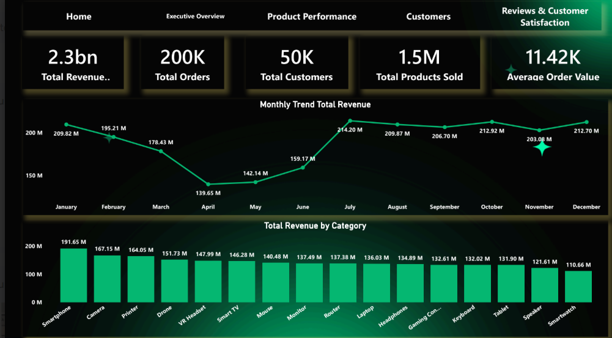
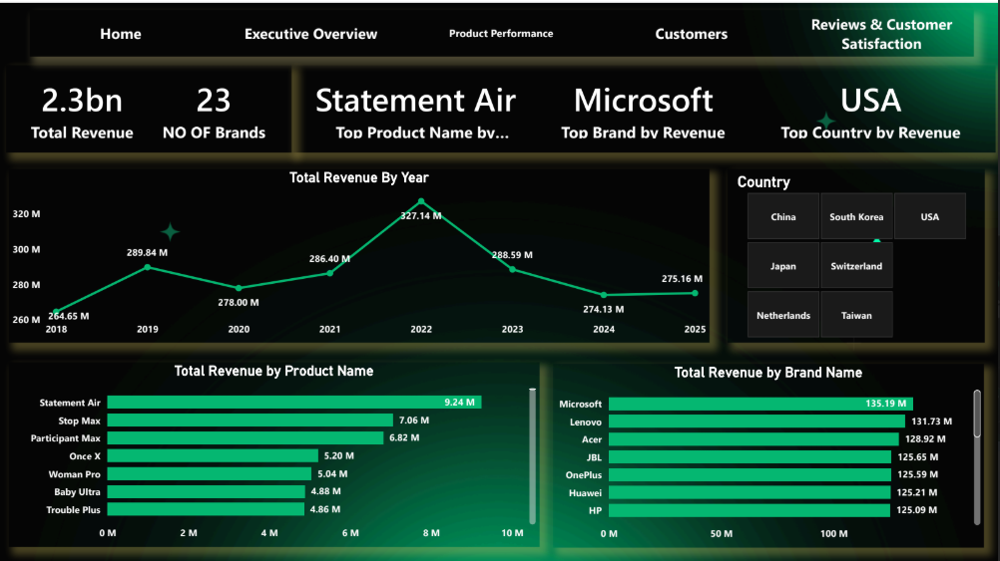
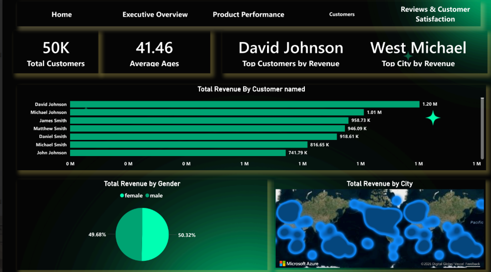
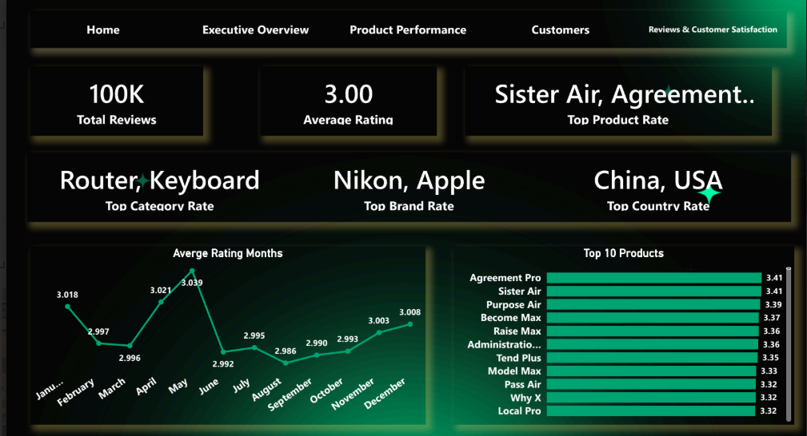
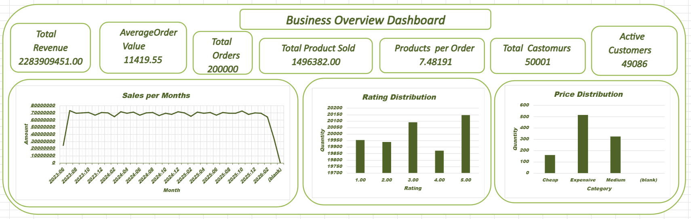
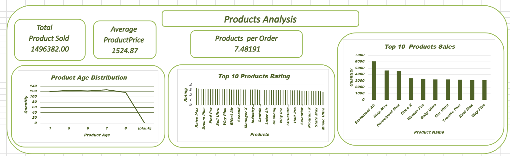
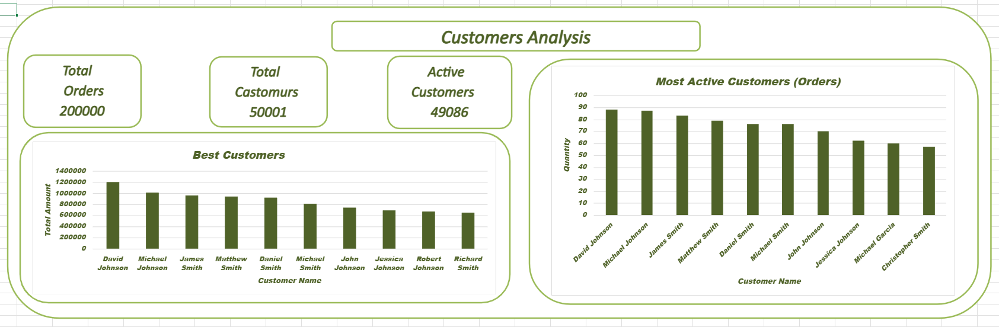
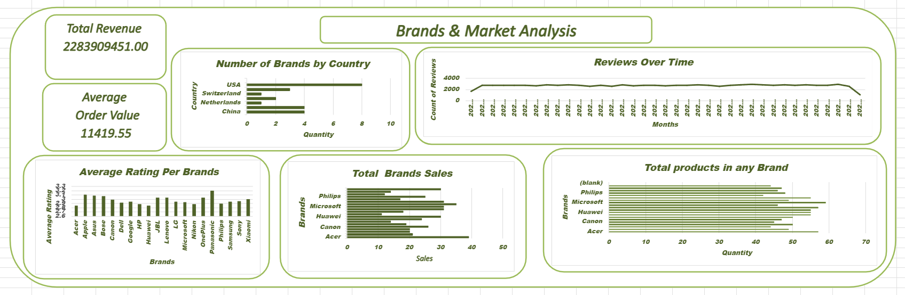

# 📊 Consumer Electronics Sales Analytics & Customer Insights System

## 🚀 Project Overview

This project is an end-to-end data analytics solution designed to analyze consumer electronics sales data and extract actionable business insights.

It combines SQL, Python, Excel, and Power BI to explore customer behavior, product performance, and revenue trends.

---

## 🧰 Tools & Technologies

* SQL Server (Data Analysis)
* Python (Pandas, Jupyter Notebook)
* Power BI (Data Visualization)
* Microsoft Excel (Reporting & Analysis)

---

## 📂 Dataset

The dataset includes:

* 50K+ Customers
* 200K+ Orders
* 1.5M Products Sold
* 100K Reviews

📥 **Download Dataset:**
👉 Check `/Data/README.md` for the download link

---

## 📊 Dashboards Preview

### 🔹 Power BI Dashboard

---

### 🔹 Excel Dashboard

---

## 📈 Key Insights

* Smartphones generate the highest revenue across categories
* A small group of high-value customers contributes significantly to total revenue
* Sales peak during mid-year (July) indicating strong seasonal trends
* Customer satisfaction remains stable around an average rating of 3.0

---

## 🧠 Business Recommendations

* Improve customer satisfaction for high-revenue brands
* Implement loyalty programs targeting VIP customers
* Increase marketing efforts for high-rated products
* Leverage seasonal trends to boost low-performing periods

---

## 🗂️ Project Structure

* **Data/** → Dataset access
* **SQL/** → SQL analysis queries
* **Python/** → Data generation & analysis
* **PowerBI/** → Dashboard files
* **EXCEL/** → Excel reports
* **ERD/** → Database schema design
* **Documentation/** → Project documentation
* **assets/** → Dashboard screenshots

---

## ⭐ Project Highlights

* End-to-end data analysis workflow
* Multi-tool integration (SQL + Python + BI)
* Real-world business insights
* Clean and organized project structure

---

## 🙌 Author

  ** Abdollah Draz & Mohammed Mokhtar **
  

---

⭐ If you like this project, don't forget to give it a star!
